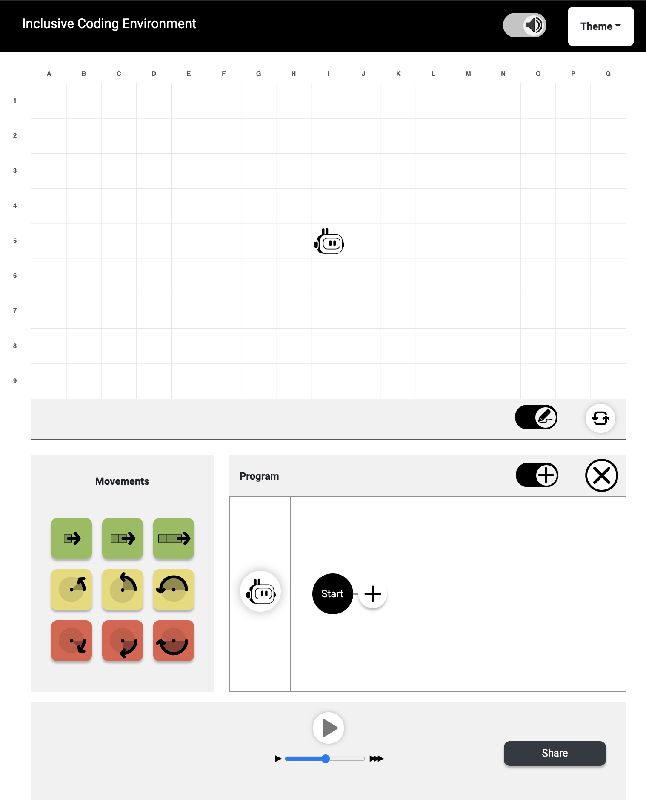

# Coding to Learn and Create - Inclusive Coding Environment

The Inclusive Coding Environment is a new educational coding tool designed for learners with disabilities. Learners can create code sequences that control the movement of a Bluetooth-connected robot. The Environment can be used with a mouse, touchscreen, or keyboard, and supports assistive technologies such as screen readers. It is a web application that works in the Chrome browser.



To try the latest development version of the Inclusive Coding Environment, visit our [development build](https://c2lc-dev.web.app/).

Currently, the Inclusive Coding Environment supports the [Dash](https://www.makewonder.com/robots/dash/) robot. We'll be adding support for new robots in upcoming releases.

## Installation for Developers

Running this project requires [npm and Node.js](https://www.npmjs.com/get-npm); once you download or fork the source code, run npm install to get all required dependencies.

```
npm install
```

## Start the application

```
npm start
```

Runs the app in the development mode. Open [http://localhost:3000](http://localhost:3000) to view it in the browser. The page will reload if you make edits. You will also see any lint errors in the console.

## Testing

```
npm test
```

Launches the test runner in the interactive watch mode. We are using the [Jest](https://jestjs.io/) and [Enzyme](https://airbnb.io/enzyme/) testing frameworks.

## Static Type Check

```
npx flow
```

We are using flow as static type checker. Learn more about [flow](https://flow.org/).

## Contributing

Contributions are welcome! To get started, fork the main repository. In general, we try to always create an [issue](https://issues.fluidproject.org/projects/C2LC/issues) and a branch for each new change. Branches should be named after the issue number that they address (e.g. C2LC-#). Each commit message should begin with the issue number, and use singular present tense. For example, "C2LC-30: Update the README to include more information about how to contribute".

Accessibility is an important part of our project. If you have any questions about accessibility, please feel free to ask questions. The [W3C's WCAG guidelines](https://www.w3.org/WAI/standards-guidelines/wcag/) are a good place to start learning about accessibility on the web.

Before submitting pull requests, please make sure all static type checks and test cases are passing.

## License
The Inclusive Coding Environment is open source software, distributed under the [BSD-3](https://github.com/codelearncreate/c2lc-coding-environment/blob/master/LICENSE.txt) license.

