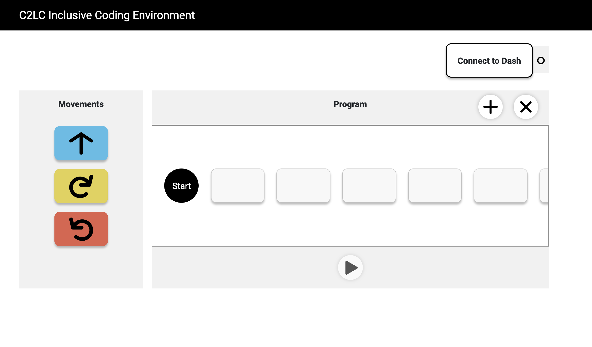

# Coding to Learn and Create Inclusive Coding Environment

The Inclusive Coding Environment is a new educational coding tool designed for learners with disabilities. Learners can create code sequences that control the movement of a Bluetooth-connected robot. The Environment can be used with a mouse, touchscreen, or keyboard, and supports assistive technologies such as screen readers. It is a web application that works in the Chrome browser.<br>



[Live Environment](https://c2lc-dev.web.app/)

Currently, the Inclusive Coding Environment supports the [Dash](https://www.makewonder.com/robots/dash/) robot. We'll be adding support for new robots in upcoming releases.

## Installation for Developers

Running this project requires [npm and Node.js](https://www.npmjs.com/get-npm); once you download or fork the source code, run npm install to get all required dependencies.

```bash
npm install
```

## Start the application

```bash
npm start
```

Runs the app in the development mode.<br>
Open [http://localhost:3000](http://localhost:3000) to view it in the browser.

The page will reload if you make edits.<br>
You will also see any lint errors in the console.

## Test

```bash
npm run test
```

Launches the test runner in the interactive watch mode.<br>
We are using [Enzyme](https://airbnb.io/enzyme/) as our testing framework.

## Static Type Check

```bash
npx flow
```

We are using flow as static type checker. <br>
Learn more about [flow](https://flow.org/).

## Contributing

Any contributions are welcome, we require you to fork from the [main repo](https://github.com/codelearncreate/c2lc-coding-environment) and follow branch name convention of C2LC-#. You can check open tasks/tickets on [fluid](https://issues.fluidproject.org/projects/C2LC/issues). Also, commit messages should include branch number and start with a singular present tense like: 'C2LC-30: Update README'.

Please note that making this project accessible is our first priority. Here's a guideline from [WCAG](https://www.w3.org/WAI/standards-guidelines/wcag/).

Before submitting pull requests, please make sure flow and test cases are passing.

## License
[BSD-3](https://github.com/codelearncreate/c2lc-coding-environment/blob/master/LICENSE.txt)
